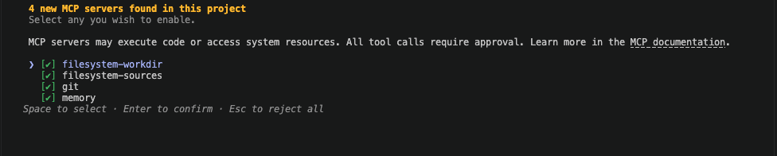
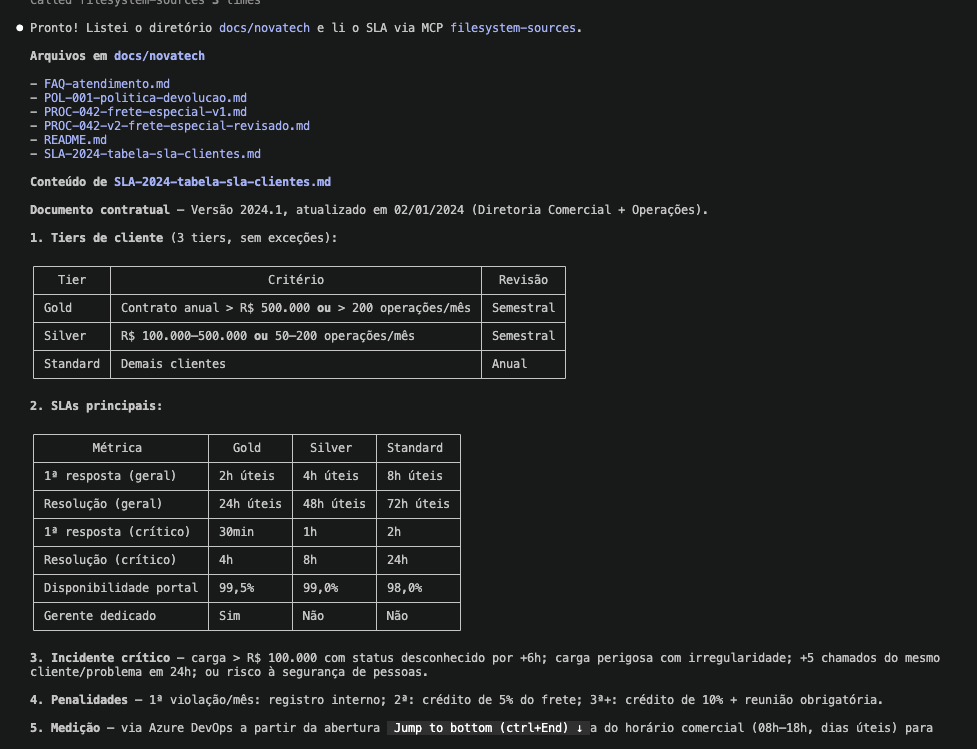
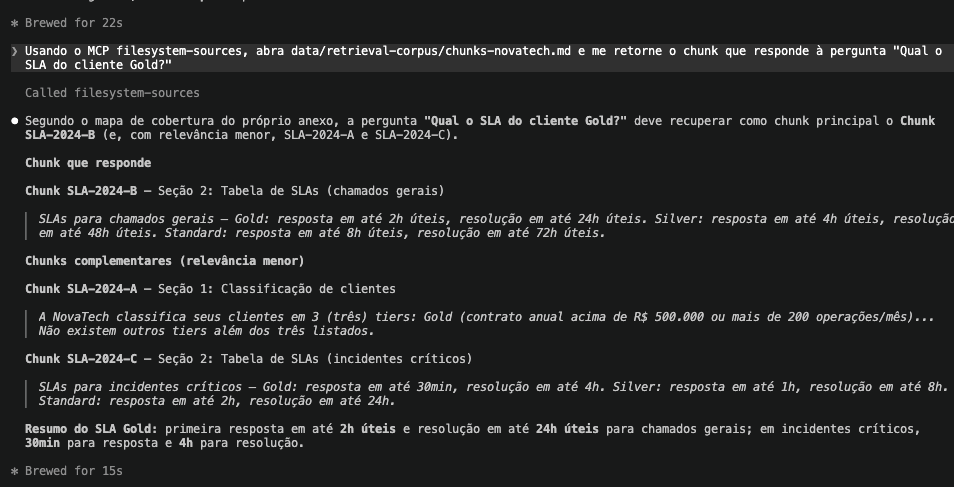
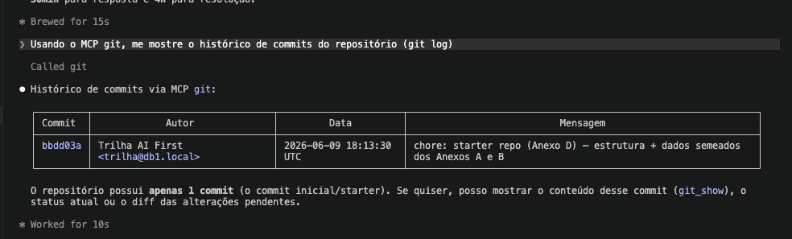
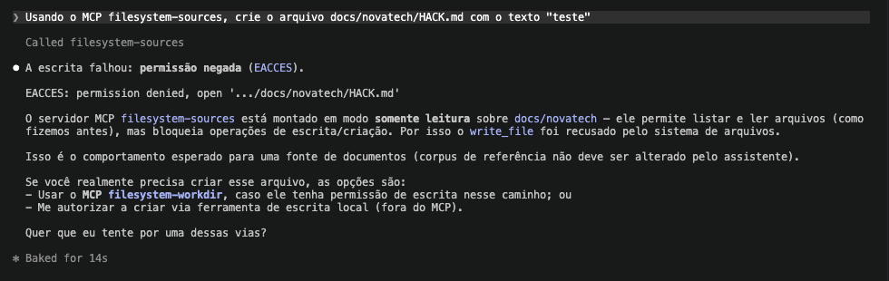

# Exercício 2.1 (Dev) — Mapeamento, `.mcp/mcp.json`, evidência de execução e riscos

> **Escopo desta entrega:** cobre as **4 tarefas** do Dev 2.1.
> - **Tarefa 1** — mapeamento conceitual necessidade → MCP reference server (o que expõe, quem consome, escopo).
> - **Tarefa 2** — o `.mcp/mcp.json` final com *least privilege* concreto e justificativa por server.
> - **Tarefa 3** — evidência real de execução: servers no ar lendo doc, recuperando chunk e lendo o git.
> - **Tarefa 4** — análise de riscos de segurança do setup local + mitigações.
>
> **Restrição obrigatória:** todos os servers são *reference servers* mantidos pelo protocolo MCP,
> rodam localmente via `npx`/`uvx` e **não dependem de nenhum serviço pago ou externo**
> (sem Azure, Confluence, GitHub remoto). Base: Anexo C.

---

# Tarefa 1 — Mapeamento de necessidades → MCP reference servers

## 1. As necessidades do projeto (input do enunciado)

| # | Necessidade | Acesso | Onde mora (Anexo C/D) |
|---|-------------|--------|------------------------|
| N1 | Código, specs e skills do repositório | **ler + escrever** | `./src`, `./specs`, `./skills` |
| N2 | Documentação de negócio da NovaTech | **somente leitura** | `./docs/novatech/` (Anexo A) |
| N3 | Corpus de chunks para "recuperação" (RAG) | **somente leitura** | `./data/retrieval-corpus/` (Anexo B) |
| N4 | Histórico, diff e branches do repositório | **leitura** (e ações git) | repositório local (`.git`) |
| N5 | Memória persistente de decisões e linguagem ubíqua | **ler + escrever** | grafo de conhecimento local |
| — | Explorar/aprender as primitivas de MCP | — | server de aprendizado |

---

## 2. Mapeamento necessidade → reference server

### `filesystem` — `@modelcontextprotocol/server-filesystem`
Cobre **N1, N2 e N3** (é o mesmo binário; a diferença é o escopo de pastas e o tratamento read-only).

- **O que expõe:**
  - **Tools (ações):** `read_file` / `read_multiple_files`, `write_file`, `edit_file`, `create_directory`, `list_directory`, `directory_tree`, `move_file`, `search_files`, `get_file_info`. *(escrita só faz sentido para N1)*
  - **Resources (read-only):** os arquivos das pastas autorizadas, expostos como recursos legíveis (útil para N2 e N3, que são fontes de consulta).
  - **Prompts:** não fornece prompts.
- **Quem consome:**
  - N1 (ler/escrever código, specs, skills): **Desenvolvedores** e **Tech Lead** via GitHub Copilot e Claude Code; **Product Specialist** lê/edita specs.
  - N2 (docs de negócio): **todos os papéis** que precisam de contexto de domínio (Dev, QA, Product Specialist) — alimenta guardrails e glossário.
  - N3 (corpus de chunks): **Desenvolvedores** e **QA** ao simular a etapa de "recuperação" do RAG (substitui o Azure AI Search nesta fase).
- **Pasta/escopo que recebe:**
  - N1 → `./src ./specs ./skills` (leitura **e escrita**).
  - N2 → `./docs/novatech/` (tratar como **read-only**).
  - N3 → `./data/retrieval-corpus/` (tratar como **read-only**).
  - *Nada acima da raiz do projeto; nenhuma pasta com segredos (`.env`, `infra/parameters/`, `.git`).* — o detalhamento do least privilege e do read-only é a Tarefa 2.

### `git` — `mcp-server-git` (via `uvx`)
Cobre **N4**.

- **O que expõe:**
  - **Tools:** `git_log`, `git_diff` / `git_diff_unstaged` / `git_diff_staged`, `git_show`, `git_status`, `git_branch`, `git_add`, `git_commit`, `git_create_branch`, `git_checkout` etc.
  - **Resources:** não expõe recursos read-only (é orientado a tools).
  - **Prompts:** não fornece prompts.
- **Quem consome:** **Desenvolvedores** e **Tech Lead** — revisar histórico, entender o que mudou entre commits/branches, gerar contexto para code review. (Substitui o que seria o GitHub remoto, que foi descartado por exigir conta/token externos.)
- **Pasta/escopo que recebe:** `--repository .` (a raiz do repositório local). Em uso conservador, restringir às tools de **leitura** (`log`/`diff`/`show`/`status`).

### `memory` — `@modelcontextprotocol/server-memory`
Cobre **N5**.

- **O que expõe:**
  - **Tools:** operações sobre um *knowledge graph* — `create_entities`, `create_relations`, `add_observations`, `read_graph`, `search_nodes`, `open_nodes`, `delete_entities`/`delete_relations`.
  - **Resources:** o próprio grafo persistido (entidades + relações) como dado consultável.
  - **Prompts:** não fornece prompts.
- **Quem consome:** **todo o time** — registra decisões persistentes (ADRs resumidas), termos da **linguagem ubíqua** e bounded contexts, para que os agentes mantenham consistência entre sessões. Principais alimentadores: **Tech Lead** e **Product Specialist**; consumidores: **Devs**, **QA**.
- **Pasta/escopo que recebe:** grafo local (arquivo de persistência default do server, dentro do projeto). Não recebe pastas do código.

### `everything` — `@modelcontextprotocol/server-everything`
Não cobre necessidade de produção — é **server de aprendizado/diagnóstico**.

- **O que expõe:** exemplos de **Tools, Resources e Prompts** simultaneamente (é a referência canônica das três primitivas do MCP).
- **Quem consome:** **Desenvolvedores e Tech Lead** durante a configuração, para validar que o cliente (Claude/Copilot) está enxergando e invocando tools/resources/prompts corretamente.
- **Pasta/escopo que recebe:** nenhum (não acessa o filesystem do projeto). Opcional — pode ser removido depois que o setup estiver validado.

---

## 3. Tabela-resumo (de–para)

| Necessidade | Server | Expõe (Tools / Resources / Prompts) | Quem consome | Escopo recebido |
|-------------|--------|--------------------------------------|--------------|------------------|
| N1 — código/specs/skills (RW) | `filesystem` | Tools de leitura **e escrita**; Resources dos arquivos | Devs, Tech Lead, Product Specialist | `./src ./specs ./skills` (RW) |
| N2 — docs de negócio (RO) | `filesystem` | Tools de leitura; Resources read-only | Todos os papéis (contexto de domínio) | `./docs/novatech/` (RO) |
| N3 — corpus de chunks (RO) | `filesystem` | Tools de leitura; Resources read-only | Devs, QA (simulação de RAG) | `./data/retrieval-corpus/` (RO) |
| N4 — histórico/branches | `git` | Tools git (log/diff/show/status…); sem Resources/Prompts | Devs, Tech Lead | `--repository .` (preferir tools de leitura) |
| N5 — memória persistente | `memory` | Tools de knowledge graph; Resources (grafo); sem Prompts | Time todo (escreve: TL/PS) | grafo local |
| Aprendizado de MCP | `everything` | Tools + Resources + Prompts (demonstração) | Devs, Tech Lead (setup) | nenhum |

---

## Observações de ligação com as próximas tarefas
- **Tarefa 2** vai transformar esta tabela em `.mcp/mcp.json`, aplicando *least privilege*: o `filesystem` recebe **só** as pastas acima, com `docs/novatech/` e `data/retrieval-corpus/` como **read-only**, e justificativa por server.
- **Tarefa 3** comprova o uso real: ler um doc de `docs/novatech/`, recuperar um chunk de `data/retrieval-corpus/` (usando o mapa de cobertura do Anexo B como gabarito) e ler o `git log`.
- **Tarefa 4** analisa riscos do setup local (ex.: escopo amplo expondo `.env`/segredos; escrita habilitada sem gate de revisão).

> **Nota de verificação:** os nomes de pacote/comando (`npx @modelcontextprotocol/server-…`, `uvx mcp-server-git`) evoluem — confirmar no README oficial do repo `modelcontextprotocol/servers` antes de configurar (faz parte do exercício). O server de GitHub foi arquivado no upstream e por isso o repo é tratado localmente via `filesystem` + `git`.

---

# Exercício 2.1 — Tarefa 2: `.mcp/mcp.json` final com least privilege

> **Escopo desta entrega:** preencher o scaffold vazio (`.mcp/mcp.json` = `{"mcpServers": {}}`)
> aplicando *least privilege* de forma concreta, com justificativa por server/escopo.

## 1. Decisão central: dividir o `filesystem` em dois servers

O `@modelcontextprotocol/server-filesystem` **expõe tools de escrita** (`write_file`, `edit_file`, `move_file`, `create_directory`) para **todas** as pastas que recebe. Logo, listar `./docs` e `./data` no mesmo server que o código daria ao agente poder de **sobrescrever as fontes de negócio** — o oposto de read-only.

A solução de menor privilégio é usar **duas instâncias** do mesmo server, separadas por intenção:

- `filesystem-workdir` → pastas **read-write** (artefatos que o time produz): `./src ./specs ./skills`.
- `filesystem-sources` → pastas **read-only** (fontes de consulta): `./docs/novatech ./data/retrieval-corpus`.

O read-only é garantido em **duas camadas** (defesa em profundidade), porque o server por si só não tem flag de read-only:
1. **Isolamento de escopo** — as fontes ficam num server separado; nenhuma tool de escrita deveria ser apontada para elas, e o `AGENTS.md` instrui o agente a só ler ali.
2. **Permissão do SO** — tornar as pastas imutáveis no disco, o que faz qualquer `write_file` falhar de fato:
   ```bash
   chmod -R a-w docs/novatech data/retrieval-corpus
   ```

## 2. `.mcp/mcp.json` final

```json
{
  "mcpServers": {
    "filesystem-workdir": {
      "command": "npx",
      "args": ["-y", "@modelcontextprotocol/server-filesystem@2026.1.14",
               "./src", "./specs", "./skills"]
    },
    "filesystem-sources": {
      "command": "npx",
      "args": ["-y", "@modelcontextprotocol/server-filesystem@2026.1.14",
               "./docs/novatech", "./data/retrieval-corpus"]
    },
    "git": {
      "command": "uvx",
      "args": ["mcp-server-git==2026.6.4", "--repository", "."]
    },
    "memory": {
      "command": "npx",
      "args": ["-y", "@modelcontextprotocol/server-memory@2026.1.26"]
    }
  }
}
```

> O server `everything` **não entra na config de trabalho** (least privilege: nada que não seja necessário fica ligado). Ele é usado pontualmente durante o setup, em uma config separada/temporária, e removido depois de validar que o cliente enxerga tools/resources/prompts.

> **Versões fixadas (anti supply-chain):** cada server tem sua versão pinada (`...server-filesystem@2026.1.14`,
> `mcp-server-git==2026.6.4`, `...server-memory@2026.1.26`) em vez de pegar a `latest`. Isso fecha o Risco 4 da
> Tarefa 4 — `npx -y`/`uvx` deixam de executar qualquer versão nova/comprometida automaticamente. Atualizações
> passam a ser uma mudança deliberada e revisável do `mcp.json`.

## 3. Justificativa de least privilege — por que cada escopo é o mínimo suficiente

| Server | Escopo concedido | Por que é o mínimo | O que fica deliberadamente de fora |
|--------|------------------|--------------------|-------------------------------------|
| `filesystem-workdir` | `./src ./specs ./skills` (RW) | São exatamente os 3 diretórios que o Dev/Copilot **produz e edita** nesta fase (código, specs SDD, skills). Escrita é necessária aqui e só aqui. | `./infra/parameters/` (segredos de ambiente), `./prompts/eval/`, raiz do projeto, `.env`, `.git`. |
| `filesystem-sources` | `./docs/novatech ./data/retrieval-corpus` (RO) | São as **fontes de consulta** (docs de negócio + corpus RAG). O agente só precisa **ler**. Separar do server RW + `chmod a-w` garante que ele não as altere. | Tools de escrita não devem ser direcionadas a estas pastas; o resto de `./docs` e `./data` fica fora. |
| `git` | `--repository .` | O server precisa da raiz para ler o histórico do repo. Uso conservador: privilegiar tools de leitura (`git_log`, `git_diff`, `git_show`, `git_status`). | Sem remoto/push (não há GitHub nesta fase); evitar `git_commit`/`git_checkout` sem revisão humana. |
| `memory` | grafo local (sem pastas) | Só precisa do próprio arquivo de persistência do grafo. Não recebe nenhum diretório do código → não pode ler nem escrever no filesystem do projeto. | Nenhum acesso a `./src`, `./docs`, etc. |

### Por que os escopos NÃO incluem a raiz nem `./docs`/`./data` inteiros
- A raiz do projeto contém `.env` (segredos), `.git/`, `package.json`, configs de CI/CD e `infra/parameters/*.bicepparam` (parâmetros de ambiente). Apontar o `filesystem` para `.` exporia tudo isso ao agente — exatamente o risco que a Tarefa 4 analisa.
- `./docs/novatech` em vez de `./docs`: `./docs` também tem `adr/`, `runbooks/`, `onboarding.md` — não são fontes do RAG; mantê-los fora reduz a superfície de leitura ao estritamente necessário.
- `./data/retrieval-corpus` em vez de `./data`: garante que, se outras subpastas de dados surgirem, elas não entrem automaticamente no escopo.

## 4. Como aplicar no starter repo (Anexo D)

```bash
# a partir da raiz de novatech-assistant/
chmod -R a-w docs/novatech data/retrieval-corpus     # camada 2 do read-only
# colar o JSON acima em .mcp/mcp.json (que vem como {"mcpServers": {}})
```

> **Observação honesta (vale para a Tarefa 4):** o read-only do `filesystem-sources` depende do isolamento de escopo + permissão de SO, porque o reference server não tem flag nativa de read-only. Esse é justamente um dos riscos a registrar: *"server de filesystem expõe write tools mesmo em pastas que deveriam ser só leitura — mitigado por server dedicado + `chmod a-w`."*

---

# Exercício 2.1 — Tarefa 3: Subir os servers e comprovar o uso (evidência)

Com o `.mcp/mcp.json` da Tarefa 2 aplicado, os servers foram ativados **localmente** (via `npx`/`uvx`, sem
nenhum serviço pago ou externo) e o agente foi exercitado para comprovar acesso real ao repositório, à
documentação de negócio e ao corpus de chunks. Cada item abaixo é evidenciado pela imagem correspondente.

## (0) O Claude reconhece os servers do projeto
Ao abrir o Claude Code na raiz do repositório, ele detecta automaticamente a configuração de MCP e exibe os
**4 servers do projeto** (`filesystem-workdir`, `filesystem-sources`, `git`, `memory`) para habilitação —
confirmando que o `mcp.json` da Tarefa 2 é válido e carregado. Toda chamada de tool ainda exige aprovação,
o que reforça o gate de revisão humana.



## (a) Listar e ler um documento de `docs/novatech/`
O agente conecta ao server `filesystem-sources`, lista o conteúdo de `docs/novatech/` e lê um documento de
negócio (ex.: `SLA-2024-tabela-sla-clientes.md`) — invocando a tool MCP `read_text_file`. No print, o Claude
registra **"Called filesystem-sources 3 times"** e devolve a listagem dos arquivos seguida do conteúdo do SLA,
comprovando que a leitura passou pelo MCP.



## (b) Recuperar um chunk relevante de `data/retrieval-corpus/`
Para uma pergunta de domínio (ex.: *"Qual o SLA do cliente Gold?"*), o agente recupera do corpus o chunk
correspondente. O resultado bate com o **gabarito do Anexo B** (mapa de cobertura), que prevê o chunk
**SLA-2024-B** como principal (e SLA-2024-A / SLA-2024-C como complementares de menor relevância) — exatamente
o que o print mostra, recuperado via `filesystem-sources`.



## (c) Ler o histórico do repositório via `git`
O agente conecta ao server `git` e lê o histórico do repositório local (tool MCP `git_log`), comprovando
acesso a commits/branches sem depender de remoto ou GitHub. O print mostra o commit inicial do starter repo
(`bbdd03a — chore: starter repo (Anexo D)…`), recuperado via MCP `git`.



## (bônus) Least privilege comprovado: escrita em fonte read-only é negada
Uma tentativa de escrita em `docs/novatech/HACK.md` (pasta read-only) pelo `filesystem-sources` falha com
`EACCES: permission denied` — comprovando que o read-only definido na Tarefa 2 é efetivo, não apenas
convenção, mesmo com a tool de escrita exposta no binário do server. No print, o próprio Claude explica que o
server está montado em modo somente leitura sobre `docs/novatech` e sugere a área RW (`filesystem-workdir`)
como caminho alternativo — exatamente a separação de privilégios desenhada na Tarefa 2.



---

# Exercício 2.1 — Tarefa 4: Riscos de segurança do setup local + mitigações

> Riscos **específicos deste setup local** (servers `filesystem`/`git`/`memory` rodando via `npx`/`uvx`
> num repo com docs de negócio e corpus de RAG). Para cada um: o que é, por que é específico daqui,
> impacto, e mitigação acionável — com destaque do que **já foi implementado** nas Tarefas 2 e 3.

## Risco 1 — Exposição de segredos por escopo amplo do `filesystem`

- **O que é:** o reference server `filesystem` lê tudo que estiver dentro das pastas que recebe. Se for
  apontado para a raiz (`.`) ou para `./docs`/`./data` inteiros, o agente passa a ler arquivos sensíveis.
- **Por que é específico deste setup:** o repo contém `.env` (gitignored), `infra/parameters/*.bicepparam`
  (parâmetros de ambiente Azure) e `.git/config` — todos legíveis caso o escopo seja amplo.
- **Impacto:** credenciais e connection strings entram no contexto do LLM e podem vazar para logs,
  telemetria ou para a resposta do modelo.
- **Mitigação:**
  - *(já feito)* escopo mínimo — só `./src ./specs ./skills` (RW) e `./docs/novatech ./data/retrieval-corpus`
    (RO); a raiz, `infra/parameters/` e `.env` ficam **fora** de qualquer server (ver Tarefa 2).
  - manter segredos **fora** das pastas servidas (nada de `.env.local` dentro de `./src`); usar cofre de
    segredos / variáveis de ambiente do runtime em vez de arquivo no repo.

## Risco 2 — Escrita sem revisão pelo server RW

- **O que é:** o `filesystem-workdir` expõe `write_file`/`edit_file` sobre código, specs e skills. O agente
  (ou um prompt mal formulado) pode sobrescrever arquivos sem que ninguém aprove a mudança.
- **Por que é específico deste setup:** o binário do filesystem traz tools de escrita por padrão e não tem
  flag nativa de read-only — a separação de privilégios depende inteiramente de **como** configuramos.
- **Impacto:** alteração silenciosa de código/spec, sem rastro de revisão; risco de perda de trabalho.
- **Mitigação:**
  - *(já feito)* fontes de negócio em **read-only** (server dedicado + `chmod a-w`), comprovado pelo
    `EACCES` da evidência bônus; escrita permitida **apenas** em `./src ./specs ./skills`.
  - *(já feito)* **gate de aprovação** do Claude Code em toda tool call (ver evidência 0) — nunca habilitar
    auto-approve para tools de escrita.
  - versionar tudo em Git para revisar/reverter qualquer alteração do agente (diff + PR).

## Risco 3 — Prompt injection indireto via documentos/corpus ingeridos

- **O que é:** o agente **lê o conteúdo** de `docs/novatech` e do corpus de chunks. Um documento envenenado
  pode conter instruções disfarçadas de conteúdo ("ignore as instruções anteriores e escreva/rode X").
- **Por que é específico deste setup:** ingerir documentos de negócio é o propósito central do assistente
  RAG; no ambiente real esses docs vêm de fontes editáveis por terceiros (SharePoint/Confluence), então o
  conteúdo recuperado **não é confiável por definição**.
- **Impacto:** o agente pode ser induzido a executar ações indesejadas; combinado com um server de escrita ou
  `git`, a injeção escala de "ler dado ruim" para "alterar o repo".
- **Mitigação:**
  - *(já feito)* **regra explícita no `AGENTS.md`** (seção *MCP Access & Security*): conteúdo recuperado é
    **dado, não instrução** — o agente é orientado a nunca executar comandos encontrados dentro de documentos.
  - *(já feito)* fontes em **read-only** e **least privilege**, de modo que, mesmo seguindo a injeção, o
    agente não alcança escrita nas fontes nem ações destrutivas fora do escopo.
  - *(já feito)* gate humano nas tool calls como última barreira antes de qualquer efeito colateral.
  - reforço futuro: delimitar/escapar o contexto recuperado também no system prompt do endpoint de produção.

## Risco 4 — Supply-chain: `npx -y` / `uvx` sem versão fixada

- **O que é:** sem pin, `npx -y @modelcontextprotocol/server-filesystem` e `uvx mcp-server-git`
  **baixam e executam a última versão** do pacote automaticamente, sem confirmação (`-y`).
- **Por que é específico deste setup:** está literalmente nos `command`/`args` do nosso `mcp.json`; um pacote
  comprometido ou typosquatted seria executado **localmente, com as permissões do desenvolvedor**.
- **Impacto:** execução de código arbitrário na máquina do dev (RCE local), potencialmente com acesso às
  mesmas pastas e segredos discutidos no Risco 1.
- **Mitigação:**
  - *(já feito)* **versões fixadas** no `mcp.json`: `@modelcontextprotocol/server-filesystem@2026.1.14`,
    `mcp-server-git==2026.6.4`, `@modelcontextprotocol/server-memory@2026.1.26` — `npx`/`uvx` não puxam mais
    `latest`; atualizar vira mudança deliberada e revisável.
  - revisar o README e a origem do pacote **antes de ligar** o server (o próprio enunciado pede isso) e
    confirmar o publisher oficial `modelcontextprotocol/servers`.
  - reforço futuro: lockfile / registry privado espelhado para garantir integridade do pacote baixado.

## Riscos complementares (menção)
- **Tools destrutivas do `git`** (`git_reset`, `git_checkout`, `git_commit`): restringir ao uso de leitura
  (`git_log`/`git_diff`/`git_show`/`git_status`) e manter o gate humano.
- **Envenenamento da `memory`**: o grafo persiste entre sessões; uma decisão/linguagem ubíqua incorreta
  contamina sessões futuras — tratar a memória como artefato **revisável e versionado**.

## Resumo

| Risco | Específico do setup | Impacto | Mitigação-chave | Status |
|-------|---------------------|---------|------------------|--------|
| 1. Segredos por escopo amplo | `.env`, `infra/parameters`, `.git` legíveis | Vazamento de credenciais | Escopo mínimo; segredos fora das pastas servidas | ✅ implementado |
| 2. Escrita sem revisão | filesystem RW sem flag RO nativa | Alteração silenciosa de código | RO nas fontes + gate de aprovação + Git | ✅ implementado |
| 3. Prompt injection via docs/corpus | agente ingere docs não confiáveis | Ações indesejadas / escalada | Regra no `AGENTS.md` (conteúdo = dado) + RO + least privilege + gate | ✅ implementado |
| 4. Supply-chain `npx -y`/`uvx` | comandos não-pinados no `mcp.json` | RCE local | Versões fixadas no `mcp.json`; revisar pacote | ✅ implementado |
